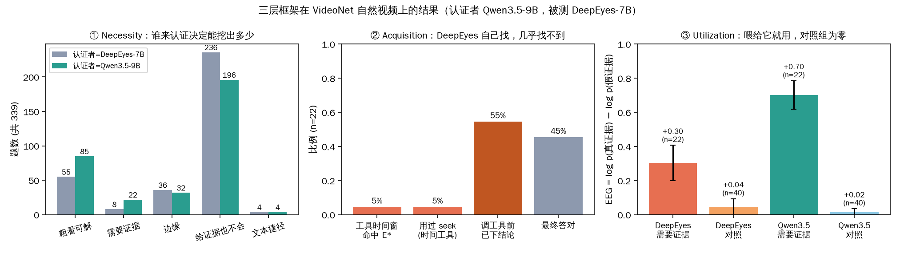

# video_entropy_agent

## 当前进展（2026-09-11）

我的研究关注视频工具调用模型（能在推理中调用工具去放大某一帧、或回看某一段视频的多模态大模型，例如用强化学习训练的 DeepEyes）是否真的在"用工具获取缺失的证据"，还是只在形式上调用工具。核心想法借用 PEA 的前提：高熵 token（模型生成时概率分布最分散、最犹豫的少数词）标记了模型真正在思考的位置。如果工具是去补缺失的信息，模型在看到证据之前就应该一直不确定，而且不确定性应该**因为**返回的内容而下降，不能只是时间上**在调用之后**下降。

目前已经完成的实验如下。
- **认证需要证据的题。** 在 VideoNet（细粒度动作识别的视频选择题数据集）的 339 道题上，用 Qwen3.5-9B 作为认证模型，通过滑窗搜索（在视频上逐段试探，找出能让模型答对的最短时间段）认证出 22 道"证据增益样本"（只看 8 帧粗采样答不对、看到约 0.4 秒的关键片段 E\*（证据窗）才能答对的题）。
- **定位比多撒帧更有效。** 等预算对照（把同样的视觉 token 花在更多均匀帧上）只能拿到定位收益的一半。
- **思考发生在调用之前。** 对 DeepEyes 的熵分析显示，62% 的高熵 token 出现在第一次工具调用之前，55% 的轨迹在调用前就写出了答案。
- **返回什么都不影响答案。** 在真实轨迹分叉实验（固定模型已生成的内容，只把工具返回换成真画面、随机画面、灰图，或把它没找到的证据窗直接塞给它，再让它续写）中，91% 的题四种返回下答案完全相同，说明调用后的熵下降与返回内容无关。
- **写下的结论锁住了答案。** 去结论分叉实验（工具调用不变，只把第一轮思考里提前写下的结论换成"还定不了"）显示，拿掉结论后答案重新随证据变化：证据窗对、随机返回错的配对是 6 : 0，p = 0.03；保留原结论时是 1 : 1。不需要证据的对照题上则没有这种变化。

由此提出方法 ERA（Entropy-Resolved Evidence Acquisition，熵驱动的证据获取）：先挑出"不确定性只在真证据下被消解、在反事实返回（随机或空白画面）下不被消解"的轨迹做冷启动（先用少量示范数据做监督微调），再用强化学习训练模型在视觉预算内主动定位证据。

目前的进度：
- 已合成 50 条 SFT 种子数据（第一轮只写"看到什么、缺什么、要回看哪一秒"，不写答案）。
- ICLR 2027 论文草稿和摘要已完成，结果处留有待填项。
- Qwen3.5 的续写实验正在进行，它将检验更强的模型在拿掉提前结论后是否会利用证据、熵是否只在真证据下下降，也就是 ERA 的数据筛选标准能否成立。
- 冷启动加 RL 的训练，以及在认证子集上的提升（论文中的 [X] 和 [Y]）尚未开始。

---

**一句话**：视频问答里的"工具调用"模型（比如 DeepEyes）看起来会主动放大画面、回看片段，但它到底是真的在找证据，还是先想好答案再走个过场？这个仓库用一套可复现的测法回答这个问题，并给出在真实视频（VideoNet）上的结果。

不熟悉背景的人，先读 **[docs/00_大白话实验记录.md](docs/00_大白话实验记录.md)**——从头讲到尾，每个名词都解释。技术细节看 `docs/02_findings_technical.md` 和 `natural/README.md`。

## 结论（三句话）

1. **真实视频里确实存在"粗看答不了、定位到某 0.4 秒才能答"的题**，而且可以用机器认证出来（339 题里 22 条），不用人工标注。
2. **把这段证据喂给模型，它会用**（信念明显向正确答案移动；不需要证据的对照题上完全不动，说明测法本身没偏差）。**但让它自己去找，几乎找不到**（22 题只命中 1 题，时间工具几乎不用，每题机械地放大一次中间帧）。
3. **它的"犹豫"发生在调用工具之前**：六成的高不确定性 token 在工具调用之前，调用后文本几乎是确定性的"确认"；这个不确定性的形状与题目需不需要证据、答没答对都无关。也就是说，工具调用是仪式，不是取证。



## 研究目标（2026-09-10 更新）

**设定**：视频输入是粗的（8 帧、低分辨率，省 token），模型在推理中**主动**回溯到关键的那一秒、放大关键的那一块，拿到高分辨率证据再作答。这个设定的好处是效率（不用一开始就全高清）、可解释（工具调用有明确的取证目的）、可训练（主动思考是被奖励的行为）。

**我们的数据对这个设定说了什么**：
- 前提成立：真实视频里存在"粗看答不了、定位到 0.4 秒才能答"的题；同样的 token 预算，定位比均匀撒帧多拿到一半收益（0.65 vs 0.52）。
- 现有模型没做到：DeepEyes 自己放大的位置命中证据 1/22，时间工具几乎不用，犹豫在调用前就结束——它调了工具、像素也变高了，但放大的是中间那帧。

**所以这个设定是训练目标，不是现状描述。** 论文的贡献放在两处：怎么**测出没做到**（三层审计，已完成），怎么**训出做到**（让"答案随证据变"成为被奖励的行为，见 `docs/01_proposal.md` §9，待做）。效率是随之而来的一列指标（准确率 vs 总 token 的 Pareto 曲线），不是标题。

**接下来补的四件事**：空间轴（搜 bbox 作空间 E\*，agentic 加 bbox IoU）；效率 Pareto 曲线（含推理回路的文本 token）；不学习的对照（运动能量选帧 / 模型报帧号 + 程序裁全帧）；更长的原片段（从 yt_id 重抓，让"先找到哪一秒"有真实难度）。

## 目录

```
docs/
  00_大白话实验记录.md          ← 先看这个
  01_proposal.md                研究方案（三层框架、指标、数据设计）
  02_findings_technical.md      现象章草稿（技术版，含 22 条逐条表）
  pilot_report.pdf              合成数据 pilot 的完整报告
  figs/                         文中用到的图
common/video_imcot.py           视频会话 + zoom/seek 工具（DeepEyes 原生工具的多帧扩展）
pilot/                          合成孪生样本（5 对）：造样本、认证、notebook
natural/                        真实视频（VideoNet）流水线：筛选 → 定位证据窗 → 四条件审计 → 熵分析
natural/out/                    全部结果（jsonl / 表 / 图 / 精简轨迹）
webapp/                         可视化网站：选题 → 看帧 → 改提示词 → 流式看 think/工具/答案 + 熵曲线
```

## 可视化网站

```bash
cd webapp && CUDA_VISIBLE_DEVICES=0 python server.py --port 4175      # 浏览器打开 http://<host>:4175
```

- `http://<host>:4175/progress`：**实验进展页**——现在在哪、研究进展树（点节点看结论/图/文件）、关键实验的逐题分叉树、下一步选项和反馈框（写入 `webapp/feedback.jsonl`）。节点内容在 `webapp/progress.json`。
- `http://<host>:4175/`：推理可视化。左栏选题（按"需要证据/边缘/粗看可解/不会"排序，带 `[E*]` 的有认证过的证据窗）、看模型输入的粗采帧、改问题和提示词；右栏逐 token 流式显示推理：思考蓝、`<tool_call>` 橙（附返回帧、是否命中 E*）、答案绿/红；底部画 next-token 熵 vs 输出位置 %，标出工具调用起点。

## 复现

环境：一个能跑 Qwen2.5-VL / Qwen3.5 的 conda env（transformers ≥ 5.7、decord、flash-attn、PIL、pyarrow、matplotlib）。代码里的绝对路径（VideoNet 目录、模型目录、字体）在 `natural/items.py`、`natural/frames.py`、`natural/belief.py`、`pilot/make_samples.py` 顶部，按自己的机器改。

```bash
cd natural
python items.py --probe                                   # 选题 + 读视频属性
CUDA_VISIBLE_DEVICES=0 python run_screen.py --model qwen35    # 阶段一+二：筛选 + 证据窗搜索（认证者）
CUDA_VISIBLE_DEVICES=0 python run_audit.py --model deepeyes --certifier qwen35   # 阶段三：审计 + agentic + 熵
python analyze.py --model deepeyes@qwen35 --figs         # 表和图
```

所有阶段可续跑（中断后重跑同一命令即可）。VideoNet 视频和从它派生的合成样本视频**不在仓库里**（gated 数据集）；`pilot/make_samples.py` 可以从本地 VideoNet 重新生成。

## 数据与模型

- VideoNet（`raivn/VideoNet`，gated）：本地 339/5000 条视频，四选一动作识别。
- 被测：DeepEyes-7B。认证者：Qwen3.5-9B。
- 结果日期：2026-09-04 ~ 09-10。
