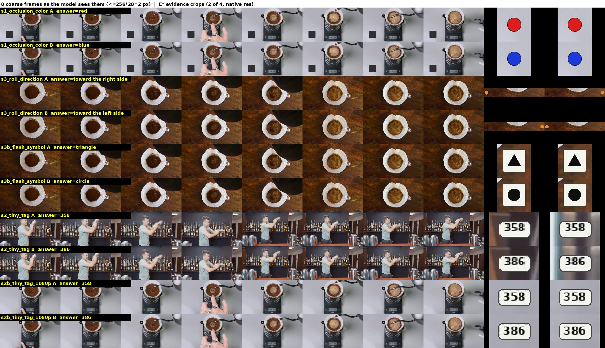
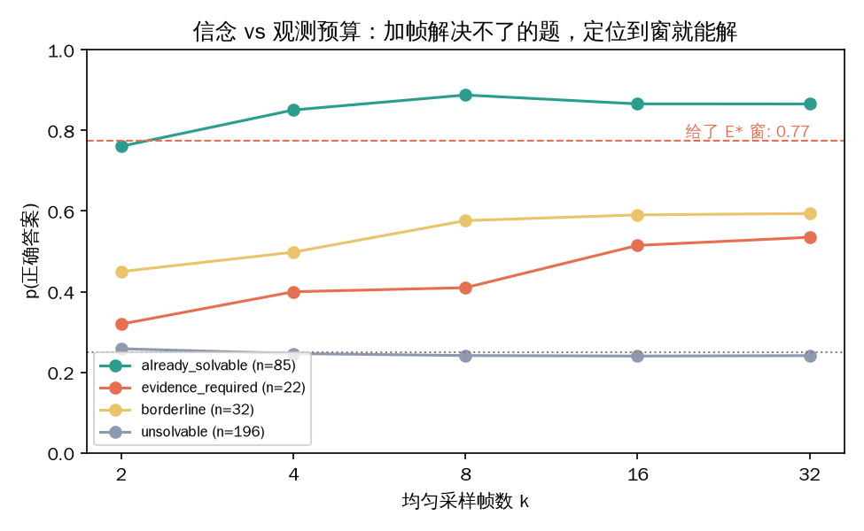
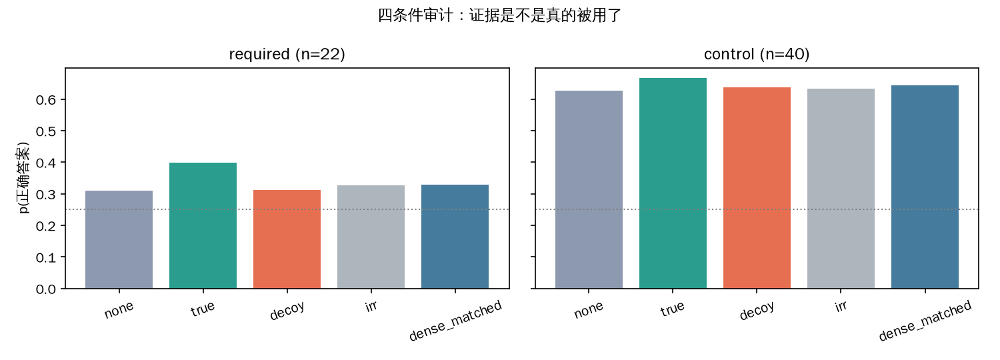
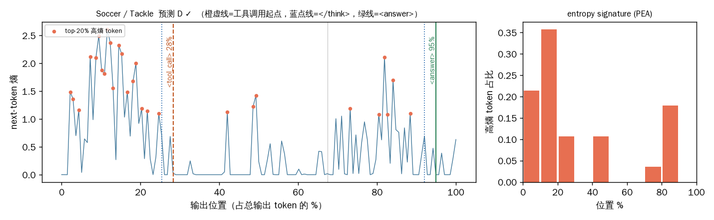
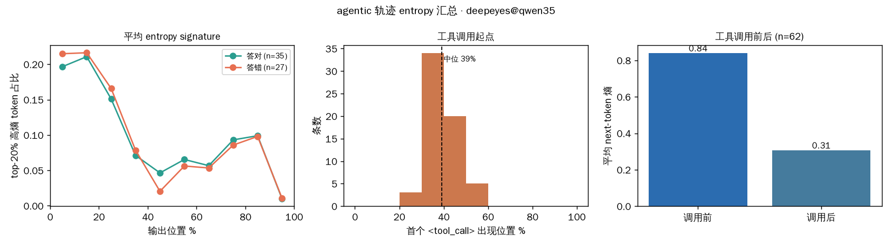

# 大白话实验记录：视频模型调工具，是在找证据还是走过场？

写给没跟过这个项目的人。每个名词第一次出现时都会解释；每个结论后面都标了对应的文件，可以自己去核。

---

## 0. 这个研究在问什么

现在有一类视频问答模型，除了看视频、答问题，还能**调工具**：比如"把第 3 帧的这块区域放大"（zoom），或者"把 2.0–2.5 秒这一段密集回看"（seek）。DeepEyes 就是这样一个模型，它是用强化学习（RL）训练出来"主动调工具"的。

论文里通常用两个数字证明这种训练有效：调工具的比例上去了，答题准确率也上去了。

**我们的疑问是：这两个数字能不能证明工具真的参与了推理？** 有一种可能是：模型看了 8 张粗糙的帧，心里已经有答案了，然后为了"符合训练时的奖励"象征性地放大一块地方，看完照样说原来的答案。这种情况下，调用率高、准确率高，但工具返回的内容根本没进它的决策——**调了，但没用**。

如果真是这样，那用"调用率 + 准确率"来评价和训练工具模型，方向就错了。

---

## 1. 我们怎么测：把问题拆成三层

打个比方：一场开卷考试。

| 层 | 考试类比 | 在视频问答里的意思 | 名字 |
|---|---|---|---|
| ① | 这道题**需不需要翻书**？有的题靠常识就能答 | 只看 8 张粗采帧，这题**客观上**答不答得了？还是必须去看某 0.4 秒的细节？ | **Necessity（必要性）**——这是**题目**的性质，跟模型无关 |
| ② | 学生**翻没翻到那一页**？ | 模型自己调工具时，放大/回看的位置**落没落在**关键那段？ | **Acquisition（获取）** |
| ③ | 翻到了那一页，**答案改没改**？ | 把关键那段直接喂给模型，它的答案**动不动**？ | **Utilization（使用）** |

三层要分开测，因为它们各自可以单独失败。"调用率高"只说明学生翻了书，不说明翻对了页，更不说明改了答案。

**几个会反复出现的名词**：

- **粗观测**：从视频里均匀抽 8 帧，每帧缩到 ≤ 256×28² 像素（约 588×336）。这是模型"第一眼"看到的东西，也是 VideoNet 官方评测的标准输入。
- **证据窗 E\***：视频里那一小段（比如 2.24–2.80 秒），把它密集抽 6 帧、高分辨率喂给模型，模型就能答对。它是**搜出来**的，不是人标的（怎么搜见 §3.2）。
- **信念 p**：模型对"正确答案"的概率。四选一的题，瞎猜是 0.25。我们不看它输出的字母，看它输出第一个字母时 A/B/C/D 四个 token 的概率（做了 4 种选项顺序的置换取平均，去掉"总爱选 A"这种偏好）。这比"对/错"灵敏得多，而且不用另一个模型当裁判。
- **EEG**：衡量"证据被用了多少"。喂真证据时对正确答案的信念，和喂**假证据**（同样大小、同样时长、但不含关键信息的片段）时的信念，取对数之差。真假证据的 token 数完全一样，所以差值只能来自**内容**。
- **agentic**：不喂证据，给模型 zoom 和 seek 两个工具，让它自己决定看哪。
- **熵**：模型生成每个字时的"犹豫程度"（对下一个 token 的概率分布的熵）。犹豫大 → 熵高。

---

## 2. 第一步：先在"造出来的题"上把测法跑通（pilot）

真实视频里"哪一段是关键证据"没有标注，所以我们先**造**几道题，证据在哪是我们自己放的，用来验证这套测法本身靠不靠谱。

**怎么造**：拿真实的 VideoNet 视频，做最小的合成编辑，每题一对"孪生"视频 A/B：
- 遮挡解除：桌上一个小圆片被卡片盖着，只在两个粗采样点之间的 1 秒里露出来；A 是红的，B 是蓝的。
- 小字标签：吧台上一张 9 像素高的标签，A 印 358、B 印 386，粗分辨率下是一个白点。
- 短窗动作：一个小球在两个采样点之间滚过，A 向右、B 向左。
- 一闪而过的符号卡：A 三角形、B 圆形。

**图怎么读**：每行左 8 张是模型粗观测下真正看到的帧，右 2 张是证据帧。A/B 两行的左 8 张肉眼分不出差别——差别只在右边。

**结果**（`pilot/eval/results_final.json`）：
- 粗看：A/B 的信念几乎一样，都在 0.25 附近 → 题确实"粗看答不了"。
- 喂真证据：信念 ≥ 0.99。喂**孪生**的证据（B 的证据喂给 A）：答案跟着翻成 B 的。喂假证据：不动。→ 测法能把"用了证据"和"没用"拉开。
- DeepEyes 自己调工具：10 次只对 2–4 次，每对孪生最多对一边，跟瞎猜一样。

**这一步的教训**：测法是通的，但这些题是我画上去的圆片和数字，审稿人一句"模型没见过合成贴图"就能打发掉。要证明"真实视频里也这样"，得去真实数据。（pilot 的完整报告见 `pilot_report.pdf`，代码在 `pilot/`。）

---

## 3. 第二步：真实视频（VideoNet）

### 3.1 数据

VideoNet 是一个细粒度动作识别的视频问答集：给一段几秒的视频，四选一问"这是哪个动作"（比如花样滑冰里的 Salchow / Loop / Toe Loop）。我们本地有 339 条视频（37 个领域，中位时长 5.9 秒）。

### 3.2 找出"真需要证据"的题（`natural/run_screen.py`）

没有人标"关键证据在哪"，所以我们让机器自己找：

1. **初筛**：分别抽 2、4、8、16、32 帧喂给模型，看信念曲线。8 帧就答对且信念 ≥ 0.7 的，归为"粗看可解"（后面当对照组用）；不看视频光看题就能答的，扔掉。剩下的进第 2 步。
2. **搜证据窗**：在视频上滑一个窗（宽度为时长的 10%/20%/30%，一共 24 个位置），每个窗内密集抽 6 帧、高分辨率，接在 8 帧粗观测后面，看哪个窗让信念最高。最小的那个能让信念 ≥ 0.6、且答对、且比 8 帧至少高 0.25 的窗，就是 E\*。找不到这样的窗 → "给了证据也不会"。

**这里有一个改变了做法的发现。** 一开始我用"均匀抽到 32 帧还答不对"来判定"信息不在视频里"。然后碰到一条板球题（Cricket / Hit the Ball Twice）：均匀 32 帧信念只有 0.07，但 [1.8, 3.6] 秒这一段密集抽 6 帧就到 0.70。**"多给帧"拿不到的信息，"给对地方"能拿到。** 所以"均匀加帧解不了"完全不等于"信息不在视频里"，必要性只能靠搜窗来认证。

**另一个弯路：谁来当裁判。** 一开始我用 DeepEyes 自己筛自己，只筛出 8 条"需要证据"的题，还把 236 条（70%）判成"给了证据也不会"。看这 236 条的数字：DeepEyes 在上面的信念是 0.235——四选一瞎猜是 0.25。也就是说 **DeepEyes 在七成的 VideoNet 题上就是在瞎蒙**，yo-yo 花式、绳结种类它压根不认识，把关键帧怼到脸上也认不出来。用它当裁判，"这题需不需要证据"根本判不了。

于是换另一个家族的模型 Qwen3.5-9B 当裁判（它零样本不调工具，只负责判题）。结果：

| 归类 | DeepEyes 当裁判 | Qwen3.5 当裁判 |
|---|---|---|
| 粗看可解 | 55 | 85 |
| **需要证据** | **8** | **22** |
| 边缘 | 36 | 32 |
| 给了证据也不会 | 236 | 196 |
| 文本捷径 | 4 | 4 |

Qwen3.5 认证的 22 条里，18 条是"只有定位到窗才行"（均匀加帧、加分辨率都不行）；证据窗宽度的中位数是时长的 10%——视频中位 4 秒，**证据是 0.4 秒的一瞬**。DeepEyes 当裁判时把这 22 条里的 15 条判成了"不会"。

**图怎么读**：横轴是均匀抽的帧数，纵轴是 Qwen3.5 对正确答案的信念。绿线（粗看可解）4 帧就到 0.85；灰线（给证据也不会）从头到尾贴在 0.25 的瞎猜线上；**橙线（需要证据）加到 32 帧也只爬到 0.54，而红色虚线是同一批题给了证据窗后的水平**——均匀加帧够不到的高度，定位到 0.4 秒一步就到。橙线和红虚线之间的空隙，就是"主动去找证据"这件事存在的理由。

**这 22 条题是不是真的（不是某个模型的幻觉）？** 两个模型各自独立搜到的证据窗，有交集或相邻的占 62%，随机配对只有 19%。更直接的检验在下一步：Qwen3.5 找到的窗喂给 DeepEyes，DeepEyes 的信念也涨。

### 3.3 喂证据，看用不用（`natural/run_audit.py`，四条件审计）

在这 22 条题 + 40 条"粗看可解"的对照题上，给模型同样的 8 帧粗观测，后面接不同的"工具返回"：

| 条件 | 接的是什么 | 如果模型真在用证据，应该 |
|---|---|---|
| none | 什么都不接 | 基线 |
| **true** | 证据窗里密采 6 帧 | 信念**涨** |
| **decoy** | 同宽度、同 token 数、但信念最低的另一个窗 | 不涨 |
| irr | 同尺寸的灰图 | 不变 |
| **dense_matched** | 把 true 多出来的 token 预算换成 26 帧均匀采样 | 如果这个和 true 一样高，说明"定位"没必要，多给帧就行 |

为什么要有 40 条对照题：它们本来就不需要证据，所以 EEG 应该 ≈ 0。如果对照组也测出正数，说明测法本身有偏（比如"多塞几张图模型就更自信"）。

**图怎么读**：左格 22 条需要证据的题，右格 40 条对照。**要看的形状**：左格只有 true 那根柱子高出来，decoy 和灰图贴着 none，dense_matched 只涨了一点；右格五根柱子齐平。

| 被测模型 | 题集 | none | true | decoy | 等预算密采 | EEG |
|---|---|---|---|---|---|---|
| DeepEyes | 需要证据 (22) | 0.31 | **0.40** | 0.31 | 0.33 | **+0.30** |
| DeepEyes | 对照 (40) | 0.63 | 0.67 | 0.64 | 0.64 | +0.04 |
| Qwen3.5 | 需要证据 (22) | 0.41 | **0.65** | 0.34 | 0.52 | **+0.70** |
| Qwen3.5 | 对照 (40) | 0.90 | 0.89 | 0.88 | 0.89 | +0.02 |

三个读法：
- **喂给它就会用**：两个模型在需要证据的题上 EEG 都明显为正；对照组 ≈ 0，测法没偏。
- **定位 ≠ 多给帧**：同样的 token 预算，均匀撒成 26 帧只拿到定位收益的一半（Qwen3.5：0.52 vs 0.65）。
- **DeepEyes 拿着证据也只到 0.40**，Qwen3.5 到 0.65——这是 DeepEyes 认不认识这些动作的问题（能力天花板），跟它用不用证据是两回事，要分开说。

### 3.4 让它自己找（agentic）

不喂证据，给 DeepEyes zoom 和 seek 两个工具，用中文提示让它自己决定看哪，最多 4 轮。22 条需要证据的题上：

| | 结果 |
|---|---|
| 工具的时间窗落进证据窗 E\* | **1 / 22** |
| 用过 seek（回看一段时间）| 1 / 22 |
| 每题成功调用次数 | 1.0（全部是放大某一帧） |
| 调工具**之前**，思考里已经写了结论 | 12 / 22 |
| 最终答对 | 10 / 22 |

证据窗起点的中位位置在视频的 40% 处，DeepEyes 放大的那一帧的中位位置在 42% 处——**它总是裁"中间那帧"，跟证据在哪无关，只是平均起来碰巧在一个区间**；证据窗只有 10% 宽，所以几乎不命中。

一条典型轨迹（Gym / Bent-Over Row，证据窗 2.45–2.80 秒，它放大的是 1.97 秒那帧）：

> **轮 1 思考**：根据视频中的动作，可以看到一个人在做弯举杠铃的动作。他的手臂弯曲，杠铃位于他的胸前，这与弯举杠铃的动作相符。**因此，正确答案是A. bent-over row。**
> **工具**：放大第 4 帧（1.97 s）
> **轮 2 思考**：通过放大第4帧的杠铃部分，我们可以更清楚地看到杠铃的形状和位置，确认这是一个弯举杠铃的动作。因此，正确答案是A。

结论写在调工具之前；工具回来之后是一句"确认"。全部 22 条的逐轮原文在 `natural/out/trajectories_deepeyes@qwen35.json`（按句拆行，直接能读）。

### 3.5 它的"犹豫"发生在哪（熵分析）

这一步借用 PEA（Prototype Entropy Alignment）的思路：不看模型说了什么，看它**在哪里犹豫**。对每条轨迹算每个 token 的熵，取最高的 20%，看它们落在输出的哪个位置（把输出长度归一化成 0–100%）。

**图怎么读**（这是 22 条里唯一放大位置命中证据窗的那条，Soccer / Tackle）：横轴是输出位置（占总输出的 %），纵轴是每个 token 的熵，红点是最犹豫的 20% 的 token。橙色虚线是它发出工具调用的位置（28%），绿线是最终作答（96%）。**红点几乎全在橙线左边**——犹豫都发生在调工具之前（"对方"、"附近"、"似乎"这些词熵最高）；工具返回之后（第二轮）熵贴着 0，文本是"进一步确认了"。命中了证据也没改判断。

**图怎么读**：左——62 条轨迹平均的"犹豫位置分布"，绿线答对、橙线答错，**两条线重合**：犹豫的形状跟答没答对没关系（跟题需不需要证据也没关系，数字见技术版）；中——工具调用出现的位置，堆在输出的 30–50%，中位 39%：不管什么题，工具都在输出走到四成的地方调；右——调用前平均熵 0.84，调用后 0.31：**不确定性在证据到来之前就已经释放完了**。

一个真正在取证的推理者，在需要证据的题上，工具返回之后应该出现第二个犹豫高峰（证据和原来的想法冲突、修正判断）。这里没有。用 PEA 的话说：这个模型的"不确定性形状"是一个跟任务无关的固定模板。

---

## 4. 结论、局限、下一步

**结论**（三层各一句）：
1. 真实视频里存在"粗看答不了、定位到 0.4 秒才能答"的题，可以机器认证，不用人标（22/339，下界）。
2. 证据喂给模型，它会用（EEG +0.30 / +0.70，对照组 ≈ 0）；同样的 token 预算，均匀加帧只拿到一半。
3. 让模型自己找，找不到（1/22）；它的犹豫在调工具之前就结束了，工具调用的位置固定在输出的 39%，是仪式不是取证。

**局限**（如实写）：
- 只有 22 条题，主表够用，分层分析不够。补下载 VideoNet 剩余 4,660 条视频或换更强的裁判（27B）都能扩。
- 裁判 Qwen3.5-9B 自己也在 58% 的题上瞎蒙，所以 22 是下界，"真实视频里这种题有多普遍"这个比例估不准。
- 只搜了时间上的证据窗，没搜空间上的框。
- VideoNet 的片段已经剪到动作本身（中位 4–6 秒），这种题天然稀有。
- 熵分析只做了 DeepEyes；Qwen3.5 零样本不调工具。

**下一步**：把这一章写进论文（现象章）；数据补充不阻塞写作；之后的方法部分是设计一种奖励，让模型"证据变了答案才该变"（见 `01_proposal.md` §9）。

---

## 5. 每个结论对应哪个文件

| 结论 | 数据/日志 | 代码 |
|---|---|---|
| 合成题上测法能拉开差距；DeepEyes 2–4/10 | `pilot/eval/results_final.json`、`pilot/evidencegap_pilot_zh_executed.ipynb`、`docs/pilot_report.pdf` | `pilot/make_samples.py`、`pilot/eval_deepeyes.py` |
| 均匀加帧 ≠ 定位（Cricket） | `natural/out/smoke3_deepeyes.json` | `natural/smoke3.py` |
| 22 条需要证据的题；换裁判从 8 到 22 | `natural/out/screen.jsonl`、`screen_table.tsv`、`log_screen_*.txt` | `natural/run_screen.py`、`pipeline.py`（screen_item / localize_item / certify） |
| 四条件审计 EEG 表 | `natural/out/audit.jsonl`（DeepEyes）、`audit_qwen35.jsonl`、`table_required22.json` | `natural/run_audit.py`、`pipeline.py`（audit_item / metrics） |
| agentic 1/22 命中；逐轮原文 | `natural/out/trajectories_deepeyes@qwen35.json` | `pipeline.py`（agentic_item）、`prompts_zh.py` |
| 熵：39% 固定起点、调用前 0.84 → 后 0.31、signature 重合 | 同上 + `natural/out/figs/entropy_deepeyes@qwen35/*.png`、`entropy_summary_deepeyes@qwen35.png` | `pipeline.py`（entropy_profile）、`traj_viz.py` |
| 所有表和图 | `natural/out/figs/` | `natural/analyze.py` |
