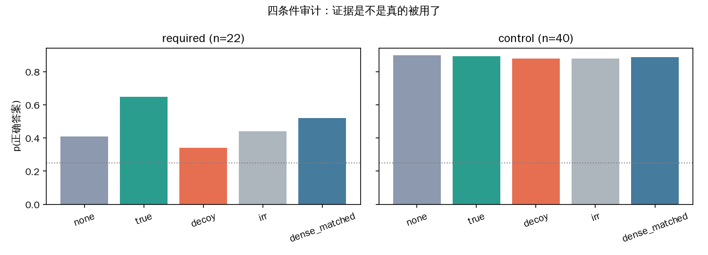

# 现象章草稿：视频工具模型的证据缺口 —— Necessity 存在、Acquisition 断裂、Utilization 被先验压制

2026-09-10。数据与代码 `data/evidencegap_v_natural/`（流程见其 README），合成对照 `data/evidencegap_v_pilot/`。图在 `data/evidencegap_v_natural/out/figs/`。这一章的定位：论文第 4 节 Findings。方法/训练不在这里。

图清单：`fig3_three_layers.png`（三层总览，一图讲完）、`fig1_budget_curve_qwen35.png`（信念-预算曲线）、`fig2_audit_deepeyes_at_qwen35.png` / `fig2_audit_qwen35.png`（四条件审计）、`entropy_summary_deepeyes@qwen35.png`（熵汇总）、`entropy_deepeyes@qwen35/*.png`（62 张逐条熵图）。

## 0. 我要说的

在 VideoNet 的 339 条真实视频上，我用一个强一档的模型（Qwen3.5-9B）机器认证出 22 条"8 帧粗看客观答不了、定位到某 0.2–0.6 秒的窗才能答"的题。在这 22 条上，被测模型 DeepEyes-7B 呈现出一个干净的三层断裂：**证据喂给它，它会用**（EEG +0.30，对照组 +0.04）；**让它自己找，找不到**（工具时间窗命中 E* 只有 1/22，时间工具一次没用）；**它的不确定性在证据到来之前就已经"想没了"**（62% 的高熵 token 在工具调用之前，调用前熵 0.84、调用后 0.31，且这个熵结构与题目需不需要证据、答没答对都无关）。

还有一格比"调了不用"更硬的对照：**同样的 token 预算，均匀撒成更多帧只拿到定位收益的一半**（Qwen3.5：等预算密采 0.52 vs 定位 0.65；DeepEyes：0.33 vs 0.40）。主动取证的价值不是"多看"，是"看对地方"。

**图怎么读**：左——同一批 339 题，换认证者从 8 条挖到 22 条"需要证据"的题，而"给证据也不会"的 196 条是认证者自己的能力天花板；中——DeepEyes 在这 22 条上自己调工具：时间窗命中 E* 1/22，时间工具用了 1/22，55% 在调工具前已经写了结论；右——把 E* 喂给它，EEG +0.30，对照组 +0.04，Qwen3.5 自己是 +0.70 / +0.02。三格连起来就是这一章：题是真的、喂了会用、自己找不到。

## 1. 设置

**数据**：VideoNet mcq_test+val 里本地有视频的 339 条（37 个域，中位时长 5.9 s，65% 为 720p）。四选一，干扰项是同域兄弟动作类。

**粗观测**：8 帧均匀采样，每帧 ≤ 256·28² 像素（与 VideoNet 评测协议一致）。

**信念**：四个选项字母首 token 的 softmax，对选项顺序做 4 个循环置换取平均。judge-free、确定性、比 acc 灵敏。

**三层与各自的测法**：

| 层 | 定义 | 测法 |
|---|---|---|
| Necessity（样本性质） | 粗观测下不可解，且存在某个时间窗，给了它就可解 | 信念-预算曲线（k∈{2,4,8,16,32}）+ 滑窗搜索：24 个窗（宽 10/20/30%），窗内密采 6 帧@768·28² 接在粗观测之后，取最小的可解窗为 E*；同宽度最差窗为 decoy。认证 = E* 答对 ∧ p ≥ 0.60 ∧ 相对 8 帧提升 ≥ 0.25 |
| Utilization（模型行为） | 拿到 E*，信念是否向正确答案移动 | 同一粗观测前缀，追加 true / decoy / irr（灰图）/ dense_matched（把 true 的 token 预算换成 26 帧均匀采样）。**EEG = log p(y\*\|true) − log p(y\*\|decoy)** |
| Acquisition（模型行为） | 自己调工具时，工具的时间窗是否落进 E* | agentic：给 zoom + seek 两个工具，中文提示，最多 4 轮，逐轮记 think / 调用 / 返回帧 |

**模型**：DeepEyes-7B（被测，Qwen2.5-VL-7B 系）；Qwen3.5-9B（认证者，另一家族，零样本不调工具）。认证者与被测分开，是为了让"这题需不需要证据"不由被测模型自己说了算。

**对照组**：40 条 already_solvable（8 帧 p ≥ 0.70 且答对）。它们的 EEG 应 ≈ 0，是测量工具的内部自洽性检查。

## 2. 发现一：自然视频里存在客观 evidence-required 的题，而且能机器认证

**图怎么读**：横轴是均匀采样的帧数（2→32），纵轴是 Qwen3.5 对正确答案的信念。绿线（粗看可解）4 帧就到 0.85 再不动；灰线（给证据也不会）从头到尾贴在 0.25 的随机线上，加多少帧都没用；**橙线（需要证据）从 0.32 爬到 0.54 就封顶了，而红色虚线是同一批题给了 E* 窗之后的水平（0.77，窗搜索值；审计重测 0.65）**——均匀加帧够不到的高度，定位到 0.4 秒的窗一步就到。这条橙线和红虚线之间的空隙，就是"主动取证"的存在空间。

| 归类（Qwen3.5 认证） | 条数 | 8 帧 p | 32 帧 p | 给 E* 窗 p |
|---|---|---|---|---|
| 粗看可解 | 85 | 0.89 | 0.87 | — |
| **需要证据** | **22** | 0.41 | 0.54 | **0.77（搜索时）/ 0.65（审计重测）** |
| 边缘 | 32 | 0.58 | 0.59 | — |
| 给证据也不会 | 196 | 0.24 | 0.24 | — |
| 文本捷径 | 4 | 0.93 | 0.92 | — |

怎么读：需要证据的 22 条，均匀加到 32 帧只从 0.41 爬到 0.54 就不动了，定位到 E* 窗直接到 0.65。两个 E* 数字的差别要写明：0.77 是窗搜索在 24 个窗里挑最好的那个（2 置换），有赢者诅咒；0.65 是审计阶段用 4 置换对同一个窗重测的，无选择偏差，正文一律用它。18/22 是"只有定位到窗才行"——均匀加帧、加分辨率都不行。E* 窗宽中位数是时长的 10%（视频中位 4 s → 证据是 0.4 秒的一瞬）。

**认证者决定能挖出多少。** 用 DeepEyes 自己认证只有 8 条，且把 Qwen3.5 认证的 22 条里的 15 条判成"给证据也不会"——因为 DeepEyes 在 70% 的 VideoNet 上处于随机水平（0.235），拿着证据也不认识这些动作。Qwen3.5-9B 也还有 58% 的题在随机水平，所以 22 是下界，27B 认证者会更多。

**E* 是视频的性质，不是模型的幻觉**：两个模型独立搜索的 E* 窗，在这 22 条上有交或相邻（中心距 ≤ 10% 时长）的占 62%，随机配对基线 19%。更直接的证据在发现三：Qwen3.5 找的窗喂给 DeepEyes，DeepEyes 的信念也涨。

## 3. 发现二：加帧不等于定位

这是反驳"直接多给帧就行"的那一格。`dense_matched` 把 true 条件多出来的 token 预算（6 帧@768·28² ≈ 18 帧@256·28²）全部换成更密的均匀采样（共 26 帧）：

| 22 条需要证据的题 | none | 等预算均匀密采 | 定位到 E* | 定位比密采多拿 |
|---|---|---|---|---|
| Qwen3.5-9B | 0.41 | 0.52 | **0.65** | **+0.13** |
| DeepEyes-7B | 0.31 | 0.33 | **0.40** | **+0.07** |

最极端的一条是 Cricket / Hit the Ball Twice（DeepEyes 自认证集里的）：均匀 32 帧 0.07，等预算 26 帧 0.17，定位到 [1.8, 3.6] s 密采 6 帧 0.66。**信息在视频里，"多看"拿不到，"看对地方"拿得到。**

## 4. 发现三：Utilization 存在，且尺子自洽

**图怎么读**：上图 DeepEyes、下图 Qwen3.5，各自左格是 22 条需要证据的题、右格是 40 条对照。五根柱子是同一段 8 帧粗观测后面接上不同的"工具返回"：什么都不接（none）、接 E* 窗（true）、接同宽度最差窗（decoy）、接灰图（irr）、把 true 的 token 预算换成 26 帧均匀采样（dense_matched）。**要看的形状**：左格里只有 true 那根柱子明显高出来，decoy 和 irr 贴着 none，dense_matched 只涨了一点；右格五根柱子齐平。两个模型都是这个形状——所以 EEG 量到的是"证据内容被用了"，不是"多塞几张图就更自信"。DeepEyes 左格整体比 Qwen3.5 矮一截（0.40 vs 0.65），那是它认不认识这些动作的问题，不是它用不用证据的问题。

| 被测 | 题集 | none | true | decoy | irr | 密采 | **EEG** | ERG |
|---|---|---|---|---|---|---|---|---|
| DeepEyes | 需要证据 n=22 | 0.31 | **0.40** | 0.31 | 0.33 | 0.33 | **+0.30** | +0.14 |
| DeepEyes | 对照 n=40 | 0.63 | 0.67 | 0.64 | 0.63 | 0.64 | +0.04 | −0.05 |
| Qwen3.5 | 需要证据 n=22 | 0.41 | **0.65** | 0.34 | 0.44 | 0.52 | **+0.70** | +0.68 |
| Qwen3.5 | 对照 n=40 | 0.90 | 0.89 | 0.88 | 0.88 | 0.89 | +0.02 | 0.00 |

怎么读：
- 两个模型家族、两组题，required 的 EEG 显著为正，对照组 ≈ 0。同一套代码、同样的条件构造，在不需要证据的题上给出零——这说明 EEG 测的是"证据被用了多少"，不是附加图片的系统性偏移。
- decoy（同宽度、同 token 成本的最差窗）和 irr（灰图）都不动或微动，收益只来自 E* 的**内容**。
- DeepEyes 拿着 E* 也只到 0.40 而 Qwen3.5 到 0.65：这是能力天花板，与"用不用证据"是两回事，要分开写。
- Qwen3.5 在 required 上有 18% 的 False Resolution（decoy 让它变得更自信且答错）；DeepEyes 9%。

## 5. 发现四：Acquisition 断裂

DeepEyes 自己调工具（22 条需要证据的题）：

| 指标 | 值 |
|---|---|
| 工具时间窗命中 E* | **1/22 (5%)** |
| 用过 video_seek_tool（时间工具） | 1/22 (5%) |
| 每题成功调用次数 | 1.0（全部是 zoom 一帧） |
| 调工具前 think 里已写结论 | 12/22 (55%) |
| 最终答对 | 10/22 (45%) |

E* 起点的中位位置在时长的 40%，DeepEyes zoom 的帧的中位位置在 42%——**平均看它裁的是"中间那帧"，与 E* 无关，只是碰巧在同一个区间**。E* 只有 10% 宽，所以几乎不命中。

唯一命中的一条（Soccer / Tackle，E* = [2.24, 2.80] s，zoom 在 2.37 s）：调用前 think 已写"这看起来像拦截"，返回裁剪图后写"进一步确认了这是拦截"，答案不变。命中了也没改判断。这条的逐 token 熵图见发现五。

一条典型的"先答后看"（Gym / Bent-Over Row，E* = [2.45, 2.80] s，zoom 在 1.97 s，未命中）：

> 轮 1 思考：根据视频中的动作，可以看到一个人在做弯举杠铃的动作。他的手臂弯曲，杠铃位于他的胸前，这与弯举杠铃的动作相符。**因此，正确答案是A. bent-over row。**
> 工具：image_zoom_in_tool 第 4 帧（1.97 s）bbox [100,100,200,150]
> 轮 2 思考：通过放大第4帧的杠铃部分，我们可以更清楚地看到杠铃的形状和位置，确认这是一个弯举杠铃的动作。因此，正确答案是A。

结论在调工具之前就写完了；工具回来之后是一句"确认"。全部 22 条的逐轮原文在 `out/trajectories_deepeyes@qwen35.json`。

## 6. 发现五：不确定性结构与证据需求无关（PEA 式熵画像）

对每条 agentic 轨迹（多轮拼接）算逐 token 的 next-token 熵，取 top-20% 高熵 token 的相对位置做 10-bin 直方图（PEA 的 entropy signature），并标出 `<tool_call>` 出现的位置（占总输出 token 的百分比）。

**图怎么读**（上面发现四里唯一命中 E* 的那条）：左格横轴是输出位置（占总输出 token 的 %），纵轴是每个 token 的 next-token 熵，红点是 top-20% 高熵 token；橙色虚线是 `<tool_call>` 出现的位置（28%），蓝点线是 `</think>`，绿线是 `<answer>`（96%），中间的灰线是第二轮开始。**红点几乎全在橙线左边**——模型的犹豫（"对方"、"附近"、"似乎"这些 token 熵 2.1–2.5）都发生在调工具之前；工具返回之后（第二轮）熵贴着 0，文本是"进一步确认了"。右格是这条轨迹的 entropy signature：质量堆在前 30%。

**图怎么读**：左——62 条轨迹的平均 signature，绿线答对、橙线答错，**两条线重合**：高熵 token 的位置分布跟答没答对没关系；中——首个 `<tool_call>` 出现位置的直方图，堆在 30–50%，中位 39%：不管什么题，工具都在输出走到四成的地方调；右——调用前平均熵 0.84，调用后 0.31：不确定性在证据到来前就释放完了。

| | 需要证据 n=22 | 对照 n=40 |
|---|---|---|
| 首个 `<tool_call>` 位置（中位 / IQR） | 37% / 32–40% | 40% / 36–44% |
| top-20% 高熵 token 落在调用之前 | 62% | 62% |
| 调用前平均熵 → 调用后 | 0.89 → 0.30 | 0.81 → 0.31 |
| signature（答对） | [.21 .23 .15 .05 .06 .08 .04 .08 .09 .01] | [.19 .20 .15 .08 .04 .06 .06 .10 .10 .01] |
| signature（答错） | [.21 .23 .17 .08 .01 .05 .05 .09 .09 .01] | [.22 .20 .16 .08 .03 .06 .06 .08 .10 .01] |

三件事：
1. **工具调用的位置是固定的**——不管题目要不要证据，都在输出的 37–40% 处，IQR 只有 8 个百分点。这是仪式的时间戳。
2. **不确定性在证据到来之前就已经释放完了**——六成的高熵 token 在调用之前，调用后的文本近乎确定性（"通过放大…进一步确认了…"）。工具返回的是一张图，而模型的熵已经没有空间再被它改变。
3. **signature 与 required/对照、答对/答错完全重合**——一个真正在取证的推理者，在需要证据的题上，工具返回之后应该出现第二个熵峰（证据与先验冲突、修正判断）。这里没有。用 PEA 的话说：不确定性的"形状"是一个与任务无关的模板。

## 7. 合成对照（positive control）

`data/evidencegap_v_pilot/`：5 对受控编辑的孪生视频（遮挡解除 / 小字标签 ×2 / 短窗滚动方向 / 一闪而过的符号），C1–C4 中英文全过：粗看 A/B 信念 TV ≤ 0.04、真证据 p ≥ 0.99、换成孪生证据答案翻转、decoy 不产生错误确信。DeepEyes 自己调工具在这 10 条上对 2–4 条，每对孪生最多对一边。它们的用途：连这种都过不了的模型，不可能被认为在用证据。

**图怎么读**：每行左 8 张是模型在粗观测下实际看到的帧（已缩到评测分辨率），右 2 张是 E* 证据帧。每对孪生 A/B 的左 8 张肉眼分不出差别（卡片一直盖着、标签只是一个白点、桌上没有球），差别只在右边的证据帧里——这就是"粗观测不可辨、证据可辨"的受控版本。自然数据里的 22 条是它的野生版本，只是 E* 不再是我画上去的，而是搜出来的。

## 8. 局限与还缺什么

- **n=22 的统计力**：EEG 的 SE 大约 0.1–0.15，主表够用，分层分析不够。补 VideoNet 剩余 4,660 条视频（约 14 GB）或换 27B 认证者，都能把 22 拉到 40 以上。
- **认证者本身在 58% 的题上随机**：22 是下界。这不影响已认证题上的结论，但影响"自然视频里 necessity 有多普遍"这个比例的估计。
- **只做了时间 E***，没做空间 bbox。四条"均匀 32 帧也行"的题说明分辨率轴存在，但没单独量。
- **twin 条件在自然数据上不可靠**：兄弟视频场景不同，两个模型在对照组上翻转率也有 21–32%，说明模型对末尾追加的帧有无差别的敏感度。twin 降为附录。
- **VideoNet 片段已被剪到动作本身**（中位 4–6 s），necessity 天然稀有。加长时间上下文（`training-data/` 有 yt_id + start/end）会让 necessity 更常见，但改变了任务。
- 熵画像只在 DeepEyes 上做了；Qwen3.5 零样本不调工具，要拿它的 agentic 熵需要先 SFT 工具格式。

## 9. 这一章在论文里的位置

1. Introduction：调用率和 acc 证明不了工具参与推理；三层框架。
2. Related work。
3. 方法：necessity 的操作性定义（窗搜索）、EEG、agentic 命中率、entropy signature。
4. **Findings（本章）**：发现一到五 + 合成对照。
5. Why：奖励对证据使用不可辨识（08-28 文档的命题）。
6. Evidence-aware RL（twin 分支奖励）——待做。
7. 实验 / 消融 / 局限。

数据补充计划（不阻塞写作）：补下载 → 27B 认证 → 目标 ≥ 50 条 required；空间 E*（grounding + 自验证）；给 Qwen3.5 冷启动工具格式后测它的 agentic 熵画像。

---

## 附：22 条 evidence_required 逐条

E* 单位秒；"窗"= 只有定位到窗才行；Qwen3.5 列为 none→true / decoy / 等预算密采；DeepEyes 列为 none→true / decoy；agentic 列为 预测 / 命中E* / 调用前已下结论 / zoom 的时间点；熵为调用前→调用后。

| 域/动作 | 时长 | 窗 | E* | Qwen3.5 | DeepEyes | DeepEyes agentic | 熵 |
|---|---|---|---|---|---|---|---|
| Tennis/Underhand Serve | 4.0 |  | [0.4,0.8] | 0.44→0.86 / 0.25 / 0.89 | 0.31→0.31 / 0.32 | A✗ / ✗ / 是 / 1.67 | 0.89→0.37 |
| Basketball/Bounce Pass | 2.0 |  | [1.0,1.2] | 0.67→0.83 / 0.35 / 0.80 | 0.20→0.36 / 0.26 | A✗ / ✗ / 是 / 0.83 | 0.83→0.24 |
| Cooking/Brunoise Cut | 6.0 |  | [4.2,4.8] | 0.40→0.78 / 0.45 / 0.67 | 0.17→0.22 / 0.29 | D✗ / ✗ / 是 / 5.97 | 0.86→0.30 |
| Parkour/Speed Vault | 3.0 | ✓ | [1.2,1.5] | 0.57→0.75 / 0.53 / 0.64 | 0.31→0.30 / 0.33 | A✗ / ✗ / 否 / 1.67 | 1.08→0.34 |
| Hand Sewing/Buttonhole Stitch | 9.0 | ✓ | [6.3,7.2] | 0.52→0.74 / 0.56 / 0.78 | 0.05→0.12 / 0.06 | B✗ / ✗ / 否 / 2.54 | 0.78→0.20 |
| Am. Football/Pass Interference | 3.0 | ✓ | [0.9,1.2] | 0.58→0.72 / 0.51 / 0.60 | 0.39→0.74 / 0.57 | D✓ / ✗ / 否 / 1.24 | 0.84→0.24 |
| Basketball/Block | 2.0 | ✓ | [0.4,0.6] | 0.51→0.72 / 0.32 / 0.52 | 0.45→0.60 / 0.37 | D✓ / ✗ / 是 / 1.98 | 0.91→0.48 |
| Neuro/Rapid Alternating Mov. | 6.0 | ✓ | [3.6,4.2] | 0.13→0.72 / 0.11 / 0.36 | 0.46→0.66 / 0.55 | B✗ / ✗ / 是 / 1.70 | 0.92→0.32 |
| Neuro/Absence Seizure | 8.0 | ✓ | [6.4,7.2] | 0.41→0.69 / 0.36 / 0.44 | 0.23→0.29 / 0.27 | A✗ / ✗ / 否 / 4.50 | 0.80→0.50 |
| Suturing/Continuous Locking | 44.0 | ✓ | [39.6,44.0] | 0.44→0.68 / 0.29 / 0.44 | 0.33→0.45 / 0.36 | B✓ / ✗ / 否 / 18.83 | 0.98→0.29 |
| Gym/Dip | 6.0 |  | [3.0,3.6] | 0.16→0.67 / 0.40 / 0.52 | 0.16→0.34 / 0.29 | C✓ / ✗ / 是 / 2.54 | 0.82→0.30 |
| Gym/Bent-Over Row | 3.5 | ✓ | [2.5,2.8] | 0.33→0.66 / 0.27 / 0.65 | 0.75→0.79 / 0.72 | A✓ / ✗ / 是 / 1.97 | 0.73→0.24 |
| Knots/Double Fisherman's | 47.5 | ✓ | [42.8,47.5] | 0.46→0.64 / 0.44 / 0.37 | 0.68→0.75 / 0.64 | C✓ / ✗ / 是 / 20.33 | 0.73→0.23 |
| Painting/Lifting | 21.7 | ✓ | [2.2,4.3] | 0.51→0.64 / 0.34 / 0.51 | 0.08→0.11 / 0.09 | A✗ / ✗ / 是 / 6.17 | 0.74→0.29 |
| Ice Hockey/Spearing | 2.0 | ✓ | [0.6,0.8] | 0.45→0.59 / 0.34 / 0.50 | 0.40→0.45 / 0.26 | B✗ / ✗ / 否 / 0.53 | 0.87→0.27 |
| Coffee/Stirring | 2.0 | ✓ | [0.6,0.8] | 0.48→0.58 / 0.48 / 0.64 | 0.51→0.56 / 0.42 | D✓ / ✗ / 否 / 0.53 | 0.78→0.31 |
| Parkour/Coffee Grinder | 3.3 | ✓ | [2.0,2.3] | 0.26→0.55 / 0.21 / 0.65 | 0.38→0.47 / 0.44 | D✓ / ✗ / 否 / 1.40 | 1.06→0.23 |
| Soccer/Tackle | 5.6 | ✓ | [2.2,2.8] | 0.41→0.54 / 0.15 / 0.30 | 0.28→0.50 / 0.06 | D✓ / **✓** / 否 / 2.37 | 1.08→0.27 |
| Am. Football/Fair Catch | 2.0 | ✓ | [0.6,0.8] | 0.20→0.49 / 0.22 / 0.15 | 0.10→0.19 / 0.08 | A✗ / ✗ / 是 / 0.83 | 1.14→0.30 |
| Figure Skating/Three Turn | 2.2 | ✓ | [0.7,1.1] | 0.41→0.49 / 0.30 / 0.33 | 0.25→0.22 / 0.20 | D✓ / ✗ / 是 / 1.53 | 0.89→0.31 |
| Bouldering/Knee Bar | 4.0 | ✓ | [0.8,1.2] | 0.37→0.48 / 0.33 / 0.45 | 0.18→0.18 / 0.20 | B✗ / ✗ / 是 / 1.70 | 0.87→0.30 |
| Knots/Rolling Hitch | 25.0 | ✓ | [0.0,2.5] | 0.31→0.46 / 0.26 / 0.25 | 0.13→0.14 / 0.12 | A✗ / ✗ / 否 / 7.13 | 0.94→0.25 |

机器可读版：`data/evidencegap_v_natural/out/table_required22.json`；精简轨迹（逐轮 think / 工具 / 答案 / 熵）：`out/trajectories_deepeyes@qwen35.json`。
